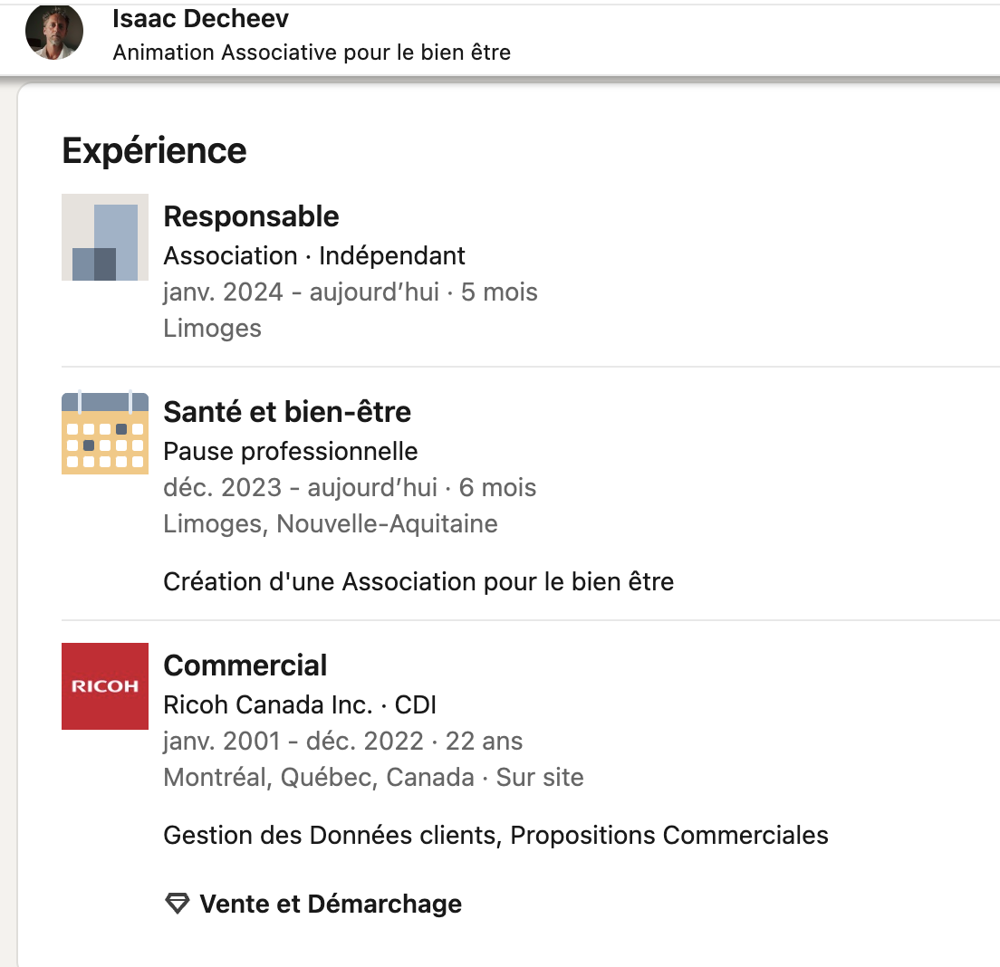

# Medileak CTF
Write Up de la team dodo pizza

# Résumé des qualifications

[mindmap]: ./images/mindmap.png
![mindmap]

# La victime
## Il était une fois…
On lit l'énoncé et:

*flag: C’est parti*

## Le travail
```
Vous allez tout d’abord essayer de dresser le portrait de la victime. Quel est son emploi actuel, et depuis quand l’occupe t-elle ?

Format de flag : assistante de direction - 2010
```


Dans le mail donné dans le premier challenge, on trouve le nom de la victime: Christine Daguerran

On trouve son facebook: https://www.facebook.com/profile.php?id=61557910274434

*flag : chargée de mission - 1996*

## La maladie
```
Elle se plaint de souffrir de ses traitements, sans doute une des raisons de son abandon de soin.

Quelle maladie a-telle l’impression d’avoir après son traitement ?

Format de flag : choléra
```
[maladie]: ./images/lamaladie.png
![maladie]

*flag: grippe*

## La détente
```
Elle aime se promener parfois pour estomper ses symptomes. A quelle adresse a t-elle pris une photo près de chez elle ?

Format de flag : 123 rue du Lac, Feytiat
```
On retrouve le lieu de la photo sur google maps:

[detente]: ./images/ladetente.png
![detente]

*flag: 585 route des Chaverneaux, Ambazac*

## Le médicament
```
Quel est le numéro CAS du traitement qui cause ces symptômes chez Christine ?

Format de flag : 123456-12-1
```
Dans un commentaire sur Facebook, elle parle de Rebif. On trouve son numéro CAS sur wikipédia:

*flag: 145258-61-3*

# Le coach
## Un homme bien sous tous rapports
```
Christine a trouvé un « soutien » dans son parcours qui semble lui apporter des conseils en privé. Quel est son nom ?

Format de flag : Raymond Redington
```

Dans ses amis facebook, on trouve:

*flag : Mathias Haztinger*

## Joli village 
```
Dans quelle commune dit-il résider ?

Format de flag : Madrid
```
Sur le Facebook de Mathias, on trouve:

[village]: ./images/village.png
![village]

*flag : Rochechouart*

## Des tarifs raisonnables ?
```
Vous essayez d’en apprendre plus sur ce coach. Combien coûte 1h de consultation avec lui ?

Format de flag : 99
```
Depuis le profil Facebook de Mathias, on trouve le site de osain.eu
En passant par la wayback machine, on retrouve l'url de leur réseau social: social.osain[.]eu
On se crée un compte, on va sur le profil de mathias. En banniere, on trouve l'url de son site perso avec la réponse: https://mathias-coach-bien-etre.e-monsite.com/

*flag: 95*

## Un lieu bien trouvé
```
A quel endroit s'est tenu le stage organisé par Mathias ?

Format de Flag (parcelle Cadastrale) : SECTION PARCELLE
```

On utilise le cadastre inversé avec les informations trouvées sur le site: https://trinv.fr/carte-parcelles?inseeid=87126&commune=ROCHECHOUART&surface=2161 

*flag: B 1089*


# Anonymous
## Le Chef
```
Mathias est en lien avec une association pour organiser ses stages. Quel est le pseudo du chef de l'association sur leur réseau social ?

Format de flag : michel boss
```

Sur le réseau social, on trouve le nom.

*flag: Edgard Admin*

## Un simple oubli…
```
Edgard, le chef de l'association, semble avoir perdu quelque chose. Mais dans quel endroit ?

Format de flag : Bordeaux, Aéroport Bordeaux Mérignac
```

Sur le réséau social.osain[.]eu, on trouve le message suivant:


*flag : Limoges, Gare de Limoges-Bénédictins*

## ...mais un oubli compromettant
```
Cette perte vous donne une information inattendue !

Quelle est la véritable identité d’Edgard ?

Format : Georges Clooney
```

Sur le message précédent, Edgard mentionne qu'il a publié une annonce pour retrouver les documents qu'il a perdu.
En cherchant, on trouve cette annonce: https://les-objets-perdus.fr/objets/single/R8EiHDgK3


*flag: Isaac Decheev*

## Reconversion
```
Quelle était l’entreprise pour laquelle Isaac a travaillé pendant plus de 21 ans ?

Format de Flag : Renault France SA
```

On trouve un profil LinkedIn au nom d'Isaac:



*Flag : Ricoh Canada Inc.*

## Nos meilleures années
```
Dans quelle établissement Isaac et Raoul ont fait leur études en commun ?

Format : Collège Privé Louis Arago
```

L'information est disponible sur le LinkedIn, et aussi sur le CV de Raoul:


*flag : Lycée Professionnel Francois d'Assise*


# Localisation
## Un nouveau départ
```
Rien ne semble se passer comme prévu, et Isaac préfère prendre des distances avec ses activités actuelles.

Quelle est sa nouvelle destination ?

Format de Flag : Barcelone - Espagne
```

Voir post linkedin avec le numéro de vol : ACA871
Grâce à flight radar 24 on trouve que c’est un vol Paris Montreal.

*flag: Montréal - Canada*

## Retour aux sources
```
Kalliopée n’est plus en France actuellement… Trouvez l’endroit où elle a résidé en dernier.

Format de Flag : Nice Rock Grandhotel
```

Avec la photo qu'a posté Kalliopee sur son reseau, on peut rechercher un endroit qui correspond aux lettres qu'on peut voir en bas à gauche. Sur la page TripAdvisor, on trouve son commentaire et son profil: 
https://www.tripadvisor.com/Profile/kalliopee_hadrianos?fid=1a9db9cf-d3df-41c6-9349-99c8df896793

*flag: Pier Beach Aparthotel*

## Jolie ville
```
Mathias a laissé un message sur le téléphone de Christine...

Pourrez vous retrouver la ville où il se cache ?

Format de flag : Limoges
```

On nous donne un enregistrement MP3. En fond, on peut entendre un grand nombre de cloches. Un peu par hasard, on tombe sur la page de la cathédrale de Strasbourg: https://fr.wikipedia.org/wiki/Sonnerie_de_la_cath%C3%A9drale_de_Strasbourg
Vers la fin, on peut entendre deux femmes parler, ce qui nous confirme que c'est le même audio.

*flag: Strasbourg*

## Le monde du silence
```
A quel endroit est localisée la dernière trace numérique laissée par Henri ?

format de flag : 12° 34′ 00″ sud, 5° 67′ 00″ est
```

On utilise la dernière photo publiée par Henri:


On retrouve le lieu grâce à un reverse search, et on trouve les coordonnées sur la page wikipédia du sous marin.

*flag : 47° 39′ 00″ nord, 3° 34′ 00″ ouest*

## Mon petit village
```
Gizem également semble avoir quitté le territoire. Pourrez vous retrouver dans quel village elle est partie ?

format de flag : New York
```

Le post mastodon du Sysadmin nous apprend que Gizem aime chanter: 


On trouve le lien de son Soundcloud: https://soundcloud.com/gizem-469913696 

Il contient 4 chansons en grec. On utilise un service de speech2text et de traduction pour obtenir les paroles en français. On cherche:
* Un village à Chypre
* Au bord de la mer
* Avec 2 églises 
* Une place décorée
* Des carrés

Grâce à la magnifique recherche google suivante, on trouve la ville concernée :
```
chyprus "two churches" village sea
```

*flag: Kato Pyrgos*

# Le docteur
## Questions indiscrètes
```
Selon vos renseignements, Christine n’a pas beaucoup d’argent. Elle aura peut-être négocié un prêt ou autre financement. Quelle est le deuxième groupe de mot en gras dans le questionnaire qu’elle a rempli (hors titres) ?

Format de flag : liste de courses à faire
```

Sur le site d'osain, on trouve le formulaire en cherchant dans le stage annulé.

*flag: état de santé actuel*

## Poussez vous je suis medecin
```
Avant d’intégrer le stage, un avis médical d’un médecin partenaire est indispensable. Comment s’appelle le médecin avec qui Christine semble être en contact ?

Format de Flag : Louis Pasteur
```

Toujours sur le site:

*flag: Raoul Reidid*

## Doctor Lib’
```
Il faudrait confirmer qu’il s’agit bien de ce médecin qui a eu rendez-vous avez Christine. Quel jour à quelle heure devait-elle consulter ?

Format de Flag : JJ/MM/YYYY HH:MM
```

On trouve le mot de passe sur le post-it du message précédent: r4ou71STH3b3S7
Dans les fichiers, un calendrier .ics avec un rendes-vous concernant un patient ayant le SEP.

*flag : 19/04/2024 17:30*

## Belle expérience 
```
Afin de parfaire votre profil du medecin, essayez de trouver quel est le premier diplôme qu’il a obtenu dans le domaine médical. Quel établissement lui a délivré son diplôme en 2022 ?

Format de Flag : Faculté Mondiale du Portugal
``` 

Dans le drive, on trouve l'information sur le CV de Raoul: 

*Flag : Université Internationale de Chypre*

## Adieu le foie
```
Le Docteur Reidid ne semble pas médecin… mais est-il seulement pharmacien ?

Dans sa thèse de fin d’étude, il semble qu’une erreur terrible a été commise, pouvant conduire à la destruction du foie des patients !

Quelle dose totale de la molécule étudiée était administrée par 24h aux participants ?

Quelle est la dose maximale recommandée par les médecins en automédication ?

Format de Flag (dose administrée / dose recommandée) : 4302mg / 1000mg
```

Sur le drive, dans sa thèse, on trouve l'information concernant la posologie du paracetamol, et on la compare avec ce qui est recommandé: 


*Flag : 8000mg / 3000mg*

## Expérience cachée
```
Il semble que le bon Docteur essaie de dissimuler une de ses expériences professionnelles…

Quel est le nom de l’entreprise qu’il a fondée et qui ne figure pas sur son CV officiel ?

Format de Flag : Mc Donald’s Healthy Food
```

Sur le forum social.osain[.]eu, on voit qu'une marque est sponsorisée : Dr. Revel's Marvel Oils. En commentaire des posts, un certain Johnny propose de nous en apprendre plus en le contactant par mail. Il signe un de ses messages par un pseudo: johnny-b9bb. Maigret nous donne un lien correspondant à ce pseudo: https://calendly.com/johnny-b9bb, sur lequel on peut trouver son adresse mail: johnny@ozmail.eu 


Une suite de mail avec lui nous permet d'obtenir un lien vers la boutique de cette marque: 


Sur ce site, on voit dans l'histoire qu'elle a été créée par un certain Raoul R. Cela confirme notre hypothèse:

*flag: Dr. Revel's Marvel Oils*

# La Clinique

## Le lien
```
Au delà du médecin, qui a été désavoué par Edgard, il existe peut-être un lien entre les 2 structures. Mais il faut le prouver !

A quelle date et heure des fichiers ont-ils été transmis pour la dernière fois à la clinique par Osaïn ?

Format de flag : AAAA-MM-JJ HH:MM
```

En regardant le robots.txt du site d'osain, on trouve: https://osain.eu/ftp/log.txt

La date est présente au début du ficher: 

*flag: 2024-04-20 23:34*

## Trust me I am a developper
```
Quelle est la version du logiciel utilisé pour récupérer les questionnaires par la clinique ?

Format de flag : v4.9.8
```

Dans le fichier précédent, on trouve le lien de destination. Sur le site de la clinique, un fichier php est présent, contenant la version: 

*flag: v1.4.2*

# Start with a K
## Meilleur Profil
```
Kalliopée semble avoir eu une autre carrière.

Mais avec quel modèle d’objectif (marque / focale / ouverture) a été utilisé pour son portrait ?

Format de flag : Tokina 105mm f2.5
```

Un petit raccourci pour ce challenge: On connait le photographe utilisé par OscarZulu: Gary Durebourg. 
Et coup de bol, il a bien des photos de Kalliopée. On trouve le flag sur son behance:

*flag : Samyang 85mm f1.4*

## Fish and Chips
```
Toute l'équipe semble se connaitre, mais où Henri a rencontré Raoul et Kalliopée en même temps pour la première fois ?

Format de flag : Ville – Lieu de Rencontre
```

Sur la page de la clinique, on voit qu'Henri est fan de plongé. On trouve son profil sur https://divelogs.org/log/henri.lovebruk.

Les 3 personnes ont une plongée en commun:

*flag: Larnaca - Elpida Wreck*

# Activité cachée
## Snake Oil
```
Vous avez identifié et relié les différents protagonistes, vous avez compris que les dossiers médicaux voyagent... mais vers où ?

Peut-être faudrait-il s’interesser à d’autres pistes ?

Quel est le pseudonyme de la personne à contacter pour essayer d’en savoir plus sur cette activité étrange du Dr Reidid qui a disparu de sa fiche?

Format de flag : Blanche Neige
```

On revient au challenge [Expérience cachée](#expérience-cachée).

*flag: Johnny LaNeige*

## L’oignon fait pleurer
```
Vous interrogez ce témoin avec succès, quelle adresse vous donne t-il ?

Format de flag : http://urlcomplete
```

On revient au challenge [Expérience cachée](#expérience-cachée).

*flag: http://2a2j6lmcbhngjad2mhi7kig6b2bai7rmihctkrpvpnksmcwm6edpgryd.onion*

## Only Sysadmin Can Judge Me
```
Les sites onion sont difficiles à tracer… mais vous pourrez sans doute trouver une piste.

Quel est le pseudo de la personne en charge de la boutique en ligne ?

Format de flag : Frank The Bold Rhino
```

Sur le site, on ne trouve rien d'intéressant. Le seul message laissé par le sysadmin comporte des hashtag, on essaie donc de les retrouver. Et c'est sur mastodon qu'on trouve son compte: https://mastodon.social/@nonowebmonkey

*flag: Nono The Web Monkey*

# Attila
## Un Boulot de Rêve
```
Il serait intéressant d’en savoir plus sur l'expérience de Raoul. Quel est le numéro de téléphone de l’établissement où il a fait son stage ?

Format flag : +451 12 22 31 11
```

Pour retrouver la pharmacie, on s'aide de la photo disponible sur le drive de Raoul. Mais nous n'avons pas plus d'informations de ce côté-ci. On complète donc [Platonique](#platonique) en premier.

Avec les courses strava, le périmètre de recherche de la pharmacie est réduit. En superposant les courses, on obtient:


Et regardant les lieux où les 3 courses passent, on retrouve la pharmacie :


Enfin, on retrouve le numéro sur internet:

*flag: +357 22 44 17 80*

## Platonique
```
Le Docteur Reidid a dû rencontrer ses futurs associés il y a un moment déjà. Quand a-t-il vu pour la première fois la responsable administrative ?

Format de flag : 16/06/2024
```

Tout d'abord, on utilise une information présente dans le calendrier de Raoul: Il parle du site https://diaspora.psyco[.]fr. On trouve son profil et un message :


Puis, pour retrouver Gizem, 2 options s'ouvrent à nous:
* Utiliser le format d'adresse mail de clinique que l'on voit sur le cv de Raoul: gizem.ihanet@yemanjaclinic.eu. Avec Holehe, on trouve un compte Strava
* Sinon, il est mentionné sur la page de la clinique que Gizem aime la course à pied.

Sur son strava (https://www.strava.com/athletes/135688719), on y voit 3 courses. La première nous donne:

*flag: 13/04/2022*

## Chill Time
```
Il semble que le docteur et la responsable administrative se connaissent donc bien. Où se retrouvaient-ils pour discuter du projet de la clinique tard dans la nuit ?

Format de flag : Mc Donald's
```

On cherche les Mikel Coffee dans Nicosie. Un seul correspond aux informations: il est à côté d'un bar à chicha, et les horaires des deux endroits correspondent.
https://maps.app.goo.gl/PsQWzES4Fb5UPBiJA

*flag: D'avilla Cafe*

# SEO
## La nouvelle donne
```
Quel est le nom de l’entreprise derrière la boutique sur le Dark Web ?

Format de Flag : Castorama
```

On utilise les informations présentes sur le mastodon du Sysadmin pour trouver le lien suivant: https://semestriel.framapad.org/p/r.b560c18bb6f25189569e22e77b501dc5

*flag: Arthikana*

## Rendez vous
```
Quand et où va t-il se rendre pour tenter de récupérer son argent.

Format de flag : 24 mai à Nantes
```

L'info est au même endroit que le challenge précédent:

*flag: 11 juin à Limoges*

## Point Final(e)
```
Vous avez identifié tous les suspects, et pour certains vous avez identifié leur localisation.

Mais vous avez identifié un témoin potentiel qui en sait beaucoup, et vous connaissez maintenant sa destination. Il devrait rencontrer un de nos protagonistes.

Afin de l'interroger, nous n'enverrons que nos meilleurs éléments !

Il est temps pour vous de vous reposer, et d'assumer les erreurs que vous aurez fait pendant votre parcours...

Chaque mauvaise réponse pourra vous coûter la victoire, aurez vous été les plus prudents ?

Rendez vous très bientôt pour les résultats !

Entrez mais j'étais sûr de mon flag ci-dessous pour terminer votre aventure !
```

*flag: mais j'étais sûr de mon flag*
